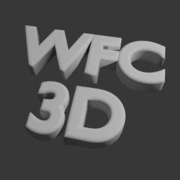

# Dan's Blender stuff 
## Add-ons / Extensionsa
Available Blender add-ons:
*  Sierpinski Triangle 
* WFC 3D Generator 
* SimpleToDo

### Install
- simply add this URL as a remote repository to your Blender repository list (Blender > Edit > Preferences > Get Extensions > Repositories > +):
    https://danrohde.github.io/blender-stuff/addons/index.json
- OR visit  https://danrohde.github.io/blender-stuff/addons/ and drag and drop the filename into your running Blender window
